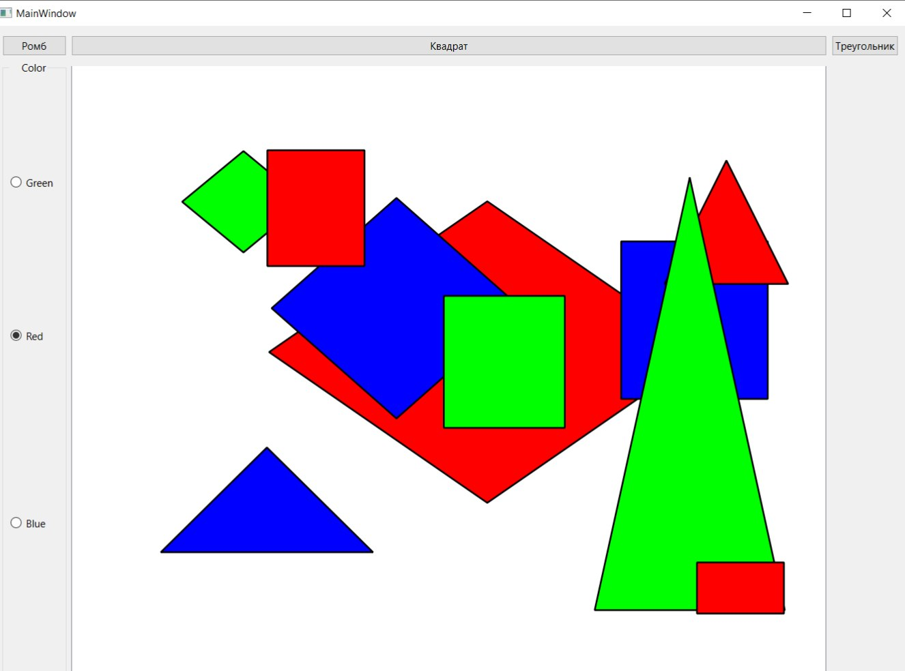

# Qt Interactive Shape Drawer (OOP & Graphics)

Десктопное C++ приложение для интерактивного рисования геометрических фигур. Проект создан для демонстрации принципов объектно-ориентированного программирования (наследования, полиморфизма) и работы с графической подсистемой Qt (Graphics View Framework).

## Стек технологий
* **Язык:** C++
* **Фреймворк:** Qt Core, Qt GUI, Qt Widgets
* **Архитектура:** ООП (Полиморфизм, Инкапсуляция)
* **Графика:** `QGraphicsScene`, `QPainter`, `QGraphicsItem`

##  Ключевые архитектурные решения

### 1. Полиморфизм и иерархия классов
Реализован базовый абстрактный класс `Figure`, от которого наследуются конкретные фигуры: `Square`, `Triangle` и `Romb`. Каждая фигура самостоятельно определяет свою логику отрисовки, переопределяя метод `paint()` с использованием `QPainter` (`QPolygonF`, `QRectF`)
### 2. Событийно-ориентированная архитектура (Event Handling)
В классе `PaintScene` (наследнике `QGraphicsScene`)переопределены системные события мыши для интерактивного рисования:
* `mousePressEvent`: создание фигуры выбранного типа (`SquareType`, `RombType`, `TriangleType`).
* `mouseMoveEvent`: Динамическое изменение координат конечной точки (`setEndPoint`) и перерисовка сцены в реальном времени
* `mouseReleaseEvent`: Фиксация фигуры и сохранение указателя в контейнер `QVector<Figure*> figures`.

### 3. Пользовательский интерфейс
Настроено управление состоянием программы через UI: выбор типа отрисовываемой фигуры через кнопки (`QPushButton`) и динамическое изменение цвета кисти (`QColor`) через радиокнопки (`QRadioButton`)
 
